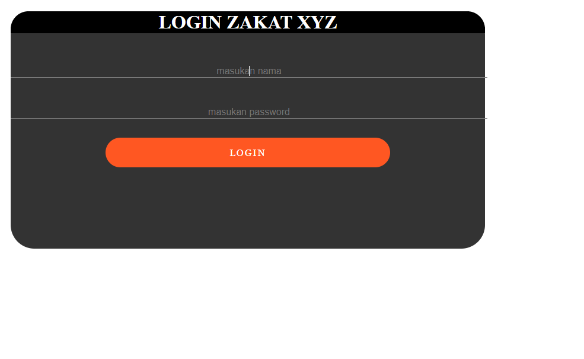
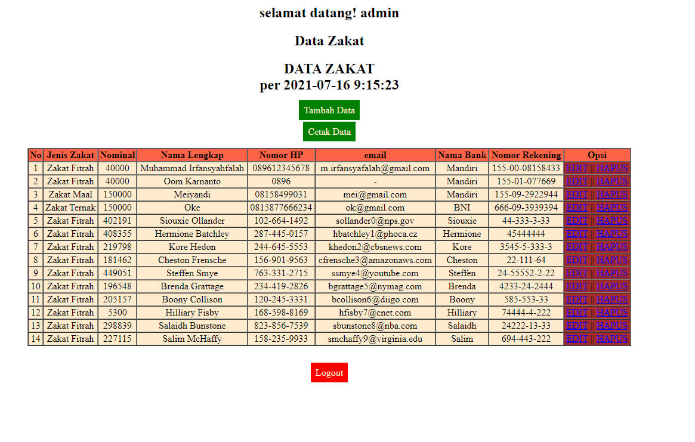
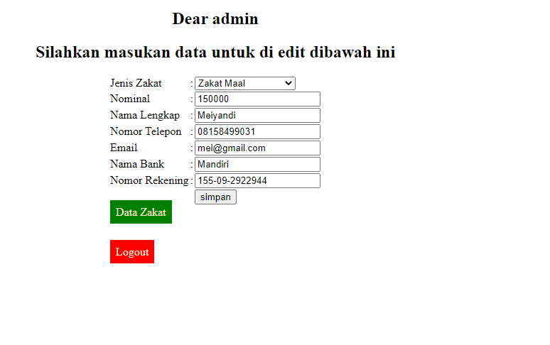
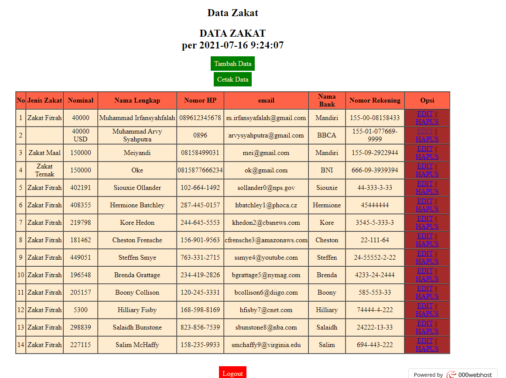
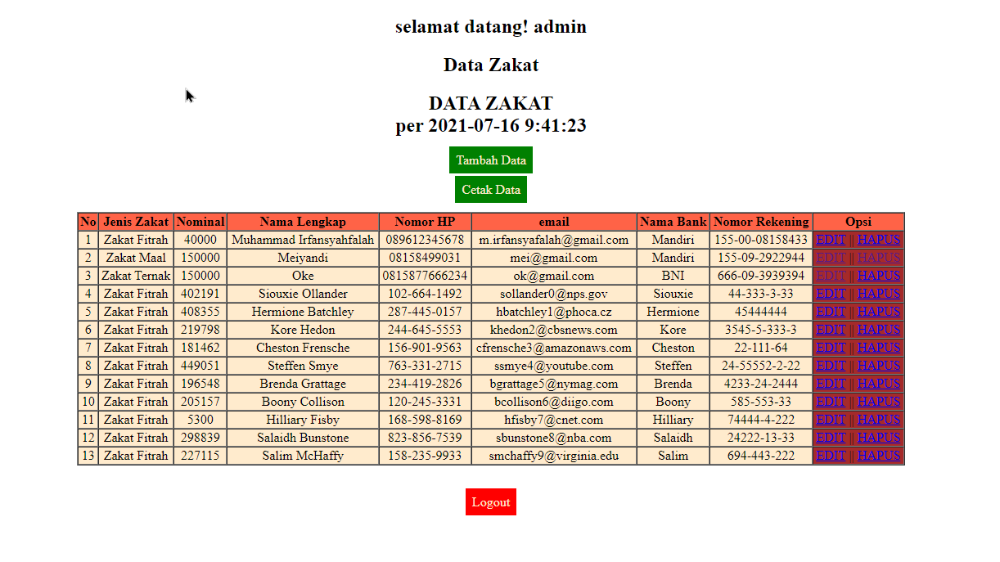

<!-- HEADINGS -->

# WEB ZAKAT UAS

jalankan index.php untuk memulai

## login.php jadi index.php
___
<p>
Digunakan sebagai tampilan awal web. tersedia sessios untuk menyimpan informasi. bisa di buktikan pada halaman berikutnya headingnya menggunakan data session input yang nantinya  di echo pada sambutan selamat datang. pada login seperti biasa user dan passwordnya adalah admin admin.</P>



## index.php jadi data.php
___
<p>
merupakan file php untuk memperlihatkan table dari database terdapat tombol input untuk diarahkan ke form input, tombol cetak untuk diarahkan ke php file dengan fungsi mencetak isi table, dan tombol logout yang akan mengakhiri session dan kembali ke index.php. pada file ini terdapat opsi yang bisa di klik antara delete ataupun edit. delete akan mengarahkan kita ke delete.php yang nantinya akan mendelete row atau bari data yang ditunjuk sebelumnya. edit akan mengedit file dan mengarahkan ke form-edit.php untuk memasukan kembali data dan menggantinya baris yang ditunjuk dengan data yang baru.</P>




```
input
logout
cetak
```

## form-input.php
___
<p>
berfungsi untuk menginput data terdapat tombol untuk cek data yang diarahkan ke data.php dan tombol logout yang diarah kan ke logout.php.
<p>

## form-edit.php
form yang digunakan untuk mengedit data terdapat 2 tombol saya mengganti id nomor 2 dengan nama saya pribadi dan email saya nanti akan saya hapus sesudahnya

```
logout dan mengecek data zakat
```




## koneksi.php
pada koneksi.php ini bertujuan untuk menghubungkan dengan database. database yang terhubung adalah database gratisan dari 000webhost dan memiliki fitur yang terbatas.
```
$db_host = "localhost";
//$db_name = "";
//$db_user = "";
//$db_pass = "";

//sengaja dikosongkan 

//username website : Zakat-Website
//password website : zakat-website

$conn = mysqli_connect($db_host,'nura','','db_zakat');


if (mysqli_connect_error()) {
    echo mysqli_connect_error();
    exit;

```
## delete.php
terdapat fungsi untuk menghapus record atau row pada table yang ditunjuk.
terdapat fungsi untuk mengembalikan urutan record menjadi berurutan kembali. sebenarnya fungsi ini tidak terlalu penting dan banyak yang menyarankan untuk tidak melakukannya.



<p>
terlihat urutan angkanya kembali sedia kalah saya mendelete record dengan nama saya yang tadi berada pada record nomor 2.
</p>

```
include 'koneksi.php';


if (isset($_GET['no_id'])) {
    $delete = mysqli_query($conn, "DELETE FROM zakat where no_id='" . $_GET['no_id'] . "' ");

 
```


## logout.php
terdapat fungsi yang digunakan untuk mengakhiri session dan kembali ke index.php

```

session_start();

if (session_destroy()) {
    header("location:index.php");
}

```

## cetak.php
digunakan untuk mencetak table menjadi dokumen sehingga berguna untuk membuat laporan dan pendataan

```
 <script>
		window.print();
	</script>
```

___
# KESIMPULAN

aplikasi ini sangat rawan bila diupload ke tempat hosting karena memiliki credential penting jadi berbahaya. aplikasi ini tidak secure hanya untuk nilai UAS Pemrograman Web 2. bisa diakses hanya dengan mengganti link. mohon tidak menyentuh apapun yang ada pada table jika memiliki kepentingan untuk meretas. Terima kasih. untuk irfan dan pak <b>Sonasa
Rinusantoro</b> selaku dosen pembimbing mata kuliah pemrograman web. 
bismilah Konsultan IT h3h3 boiyeh.

